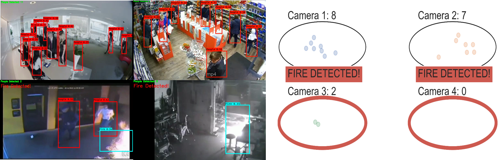

# yolo_fire_detection
People Counter and Fire Detection using YOLOv3

The YoloV3 weights trained on the COCO dataset

# <u>
 HOW TO USE THIS 
</u>
### 1. First download the weights to .\Data\Model_Weights
###   - This weights are retrained versions of the original YOLOv3 From: https://pjreddie.com/darknet/yolo/
###   - The original framework is converted to keras by: https://github.com/AntonMu/TrainYourOwnYOLO

### 2. Run the Notebook:
