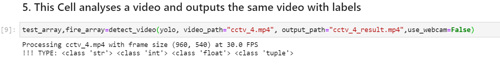
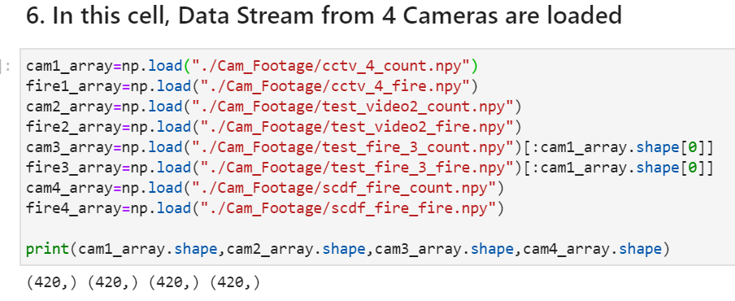
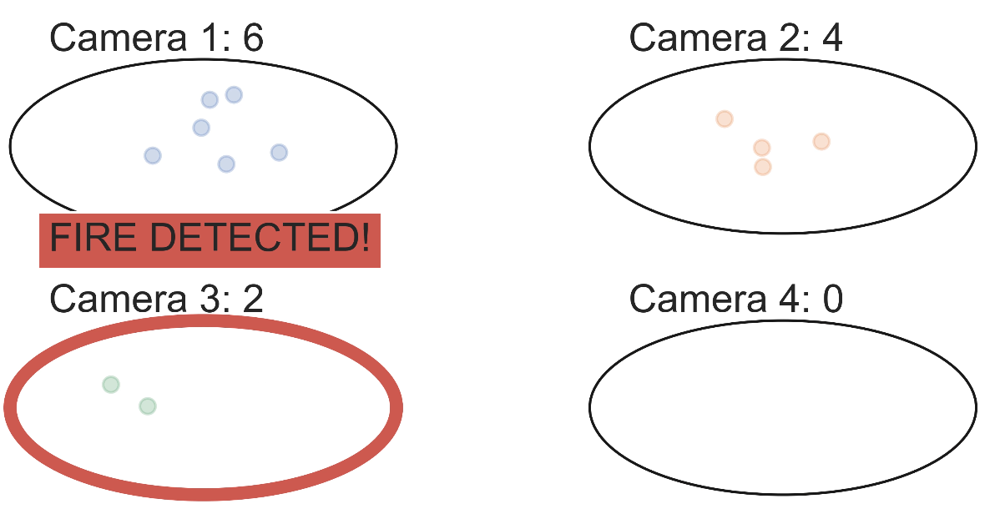
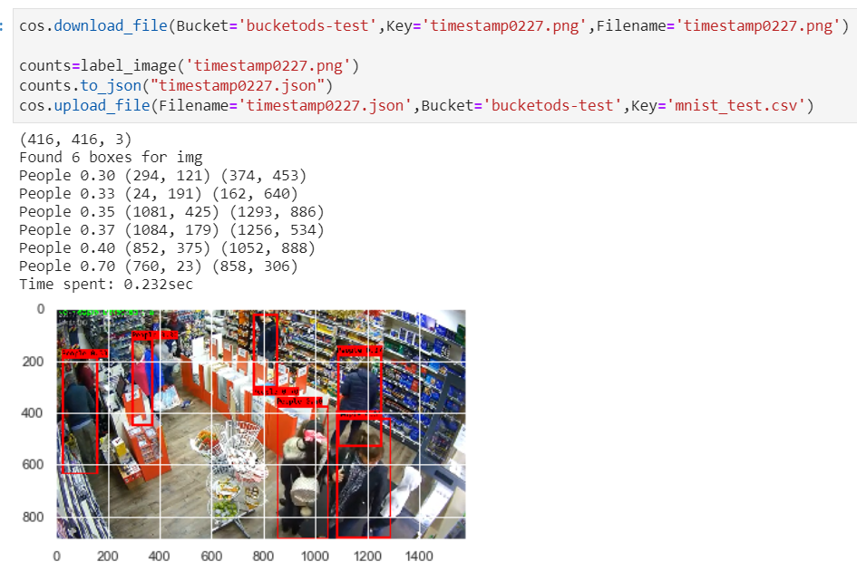

# SCDFXIBM Fire Detection Algorithm
People Counter and Fire Detection using YOLOv3

[Fire Detection Demo](https://docs.google.com/document/d/1tqfmKDCythZHiI8NvH8uefT6QIfa2nIuNtXlXZm7ew4/edit?usp=sharing)
# <u>
 Deployment 
</u>

### <u>1. Download the weights to .\Data\Model_Weights</u>
- Download the weights here: https://entuedu-my.sharepoint.com/:u:/g/personal/lchan017_e_ntu_edu_sg/EWjUUTdPzrBGgxBtj-16wBEBu5hjpZWClFlpHW5wf7ptNw?e=FaBdFQ
- This weights are retrained versions of the original YOLOv3 From: https://pjreddie.com/darknet/yolo/
- The original framework is converted to keras by: https://github.com/AntonMu/TrainYourOwnYOLO

### <u>2. Run the Model on Input Video:</u>
- Yolov3 Dependencies should be in the same folder as the notebook before running
- The Following Line in the notebook will process videos ,

- Drag your own video to be analysed to the same folder as this notebook (here its "cctv_4.mp4") under "video_path"
- Set your output directory under "output_path"
- Once the video has been processed, a labeled video should be created in the output path

### <u>3. Create Analytical Density Plot :</u>
- 2 Arrays (People Counter, Fire Counter) will be returned by the previous cell
- In this Demonstration, 4 CCTV footage has already been analysed and stored in a .npy array

- The Following Code will then output a graphical report of the detections:

### <u>4. Upload to IBM Cloud</u>
- The following code retrieves images from IBM cloud
- This code then runs the yolov3 model and outputs a labeled image
- This labeled image is then uploaded back to IBM Cloud

### Note:
- Technical limitations: This model can ideally run on ibm watson (.h5 file can be uploaded). However, there are many dependency issues that would need to be solved (tensorflow version mismatch, figuring out access to .py scripts that contains dependencies). For the purpose of this Competition, this algorithm will be run locally. Only IBM cloud is used for storage.
